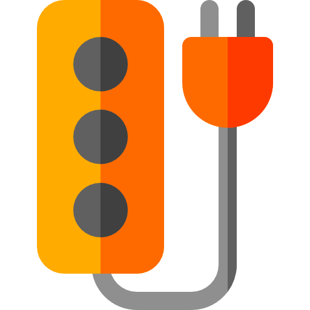

#  Fresh Chrome Extension boilerplate

## Purpose

This extension serves as a boilerplate for creating new extensions _(Manifest V3)_ for Chromium-based browsers, such as Google Chrome.

It shows basic interactions between a popup, content scripts, and the active tab. It can be easily extended to add more complex functionality.

## The biggest improvement in this version (3+)

Now when the user clicks the browser's extension button a popup is shown instead of just logging a message to the console.

<picture>
  
</picture>

## What this extension does

It provides the following functionality:

1. When installed, it adds a button to the browser's top bar.

2. Clicking the extension button opens a popup with a button labeled "Click this button to add an orange div to the page".

3. When the button in the popup is clicked, it injects a script into the active tab that:
   - Adds an orange div at the top of the page with the message "DOM modified!"
   - Logs the message "Action executed from popup!" to the DevTools console (F12)

## How to install

1. Clone or download this repository to your local machine.
2. Open your Chrome-based browser and navigate to `chrome://extensions`.
3. Enable "Developer mode" by toggling the switch in the top right corner.
4. Click on "Load unpacked" button that appears after enabling developer mode.
5. Select the directory containing the extension files (the same directory as the `manifest.json` file).
6. The extension should now appear in your browser's toolbar. If it doesn't, check whether it's hidden behind the browser's "puzzle" icon.

## Logo and Icons Attribution

The logo and icons used in this project are attributed as follows:

<a href="https://www.flaticon.com/free-icons/socket" title="socket icons">Socket icons created by Freepik - Flaticon</a>
